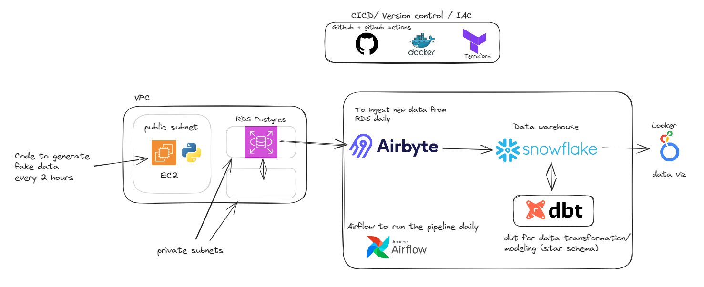
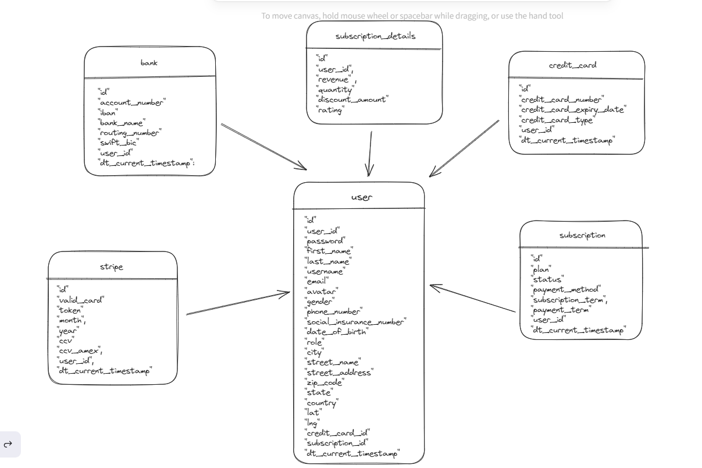
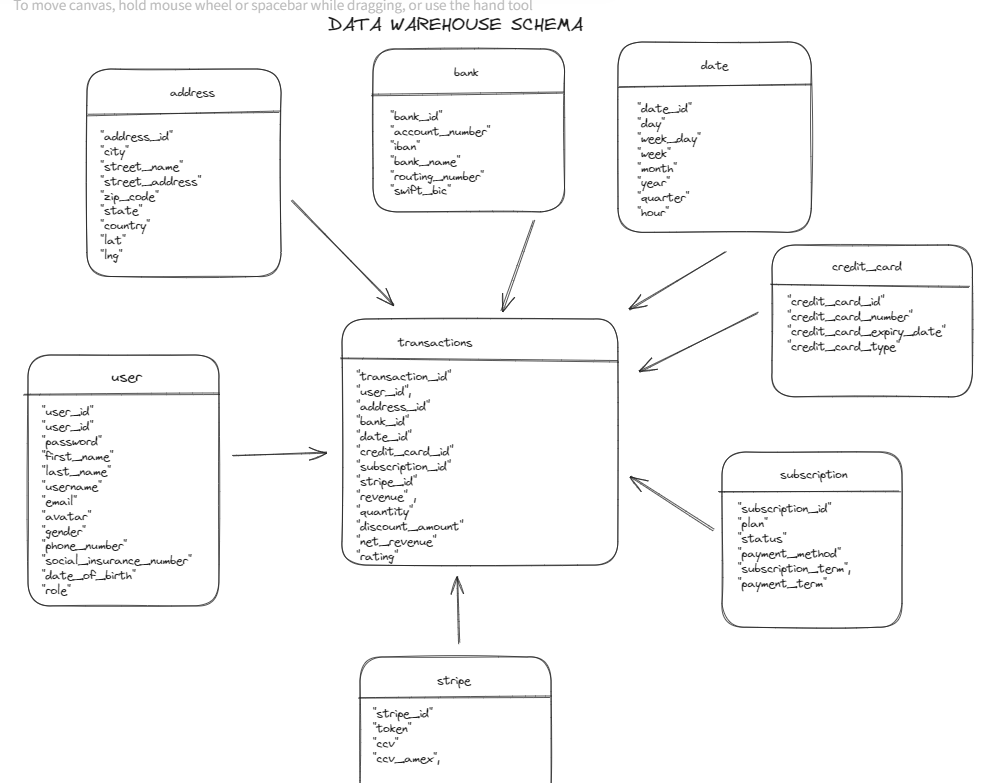
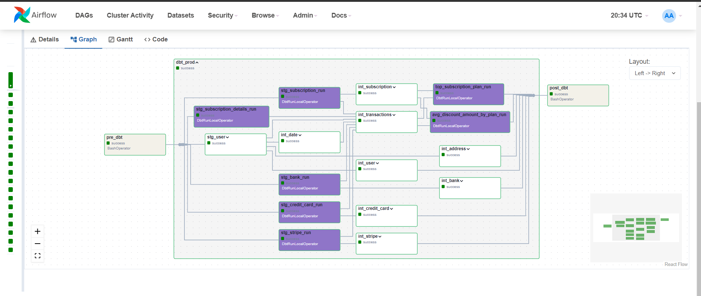
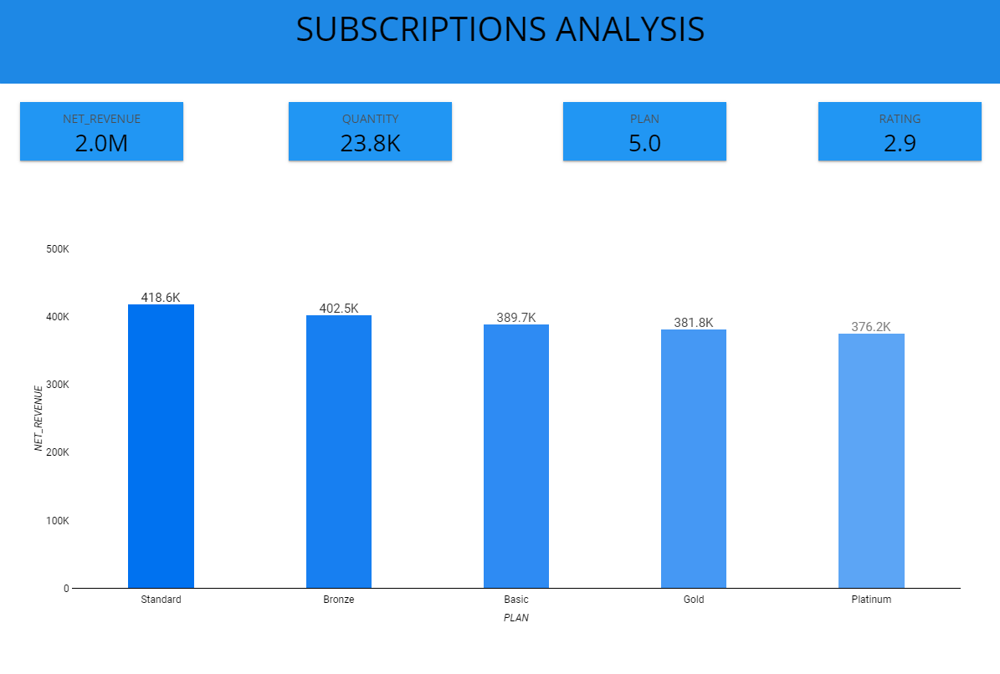

## Overview 



## Article 
Check my blog article for more details  : https://medium.com/datadriveninvestor/how-i-built-this-data-platform-in-one-week-13b457d7c323


## Setup 

* Before running the terraform apply 
export TF_VAR_pwd_db=your_db_password

* Snowflake structure 
```  
RAW  : database to store raw data coming from Airbyte (schemas : postgres_airbyte )
ANALYTICS : the production database (schemas: staging, intermediate, marts(finance))
DBT_DEV: the dev database (the same schemas as the production database)

DATA_ENGINEER : A role to allow usage of RAW database and ownership of ANALYTICS AND DBT_DEV
AIRBYTE_ROLE : used by airbyte to write in the RAW database (postgres_airbyte schema)

```

* Ingest data (daily) from RDS to Snowflake : Airbyte

## DBT structure 
Source data model 


Warehouse data model 


## Airflow : 
* When the CD to deploy the airflow code is done, we need to execute this on the EC2 instance: 
```
cd airflow 
docker exec (webserver_container_id) /bin/bash -c "source /opt/airflow/dbt_venv/bin/activate && cd /opt/airflow/dags/dbt/dbt_transformation/ && dbt deps && deactivate"
```


* Then create the snowflake_conn




## Dashboard


## What need to be improved ? 
* Terraform resource to create the tables on snowflake
* Unit test airflow dag


